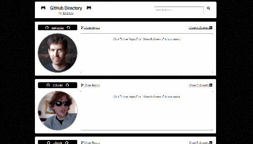

# GitHub Directory
## A web app for viewing GitHub users

### Deployed at: [https://github-directory-2020.netlify.app](https://github-directory-2020.netlify.app)

## User Story
### As a developer looking to check out the work of my peers, I would like to:
- view all GitHub users in ascending id order
  - seamlessly load more users when I reach the end of the list
- search for specific users
  - have search results load after typing stops (without clicking a button)
- see each user's top repos and followers
  - be able to follow links to repos/followers GitHub Pages

### Technologies Used
- React
- Octokit (GitHub SDK)
- react-infinite-scroll-component (npm package)
- Axios
- Netlify Serverless Functions

